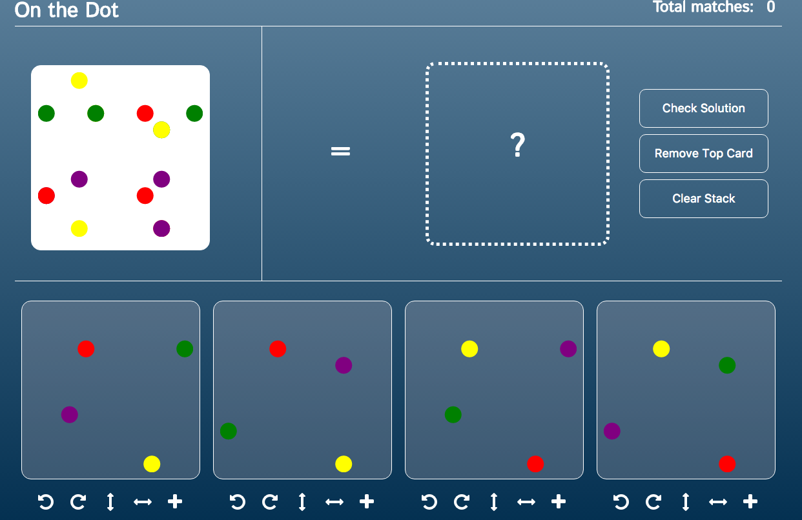
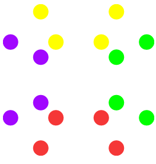
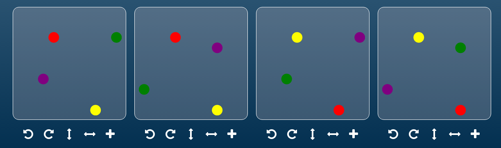
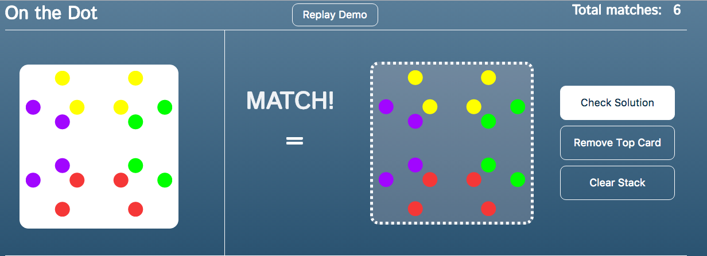

# On The Dot

[Play it here][onthedot]


 

### About

[On the Dot][gamewright] originated as a pattern-matching board game that usually supports 1-4 players. This implementation is an online solitaire version.

#### Game play
 At the beginning of each round, the player is shown a square card with a pattern of multi-colored dots.

 

 They will also receive four transparent cards that each have four dots (one red, one green, one purple, one yellow). These cards maintain the same pattern throughout all rounds.

 

 The goal of the game is to manipulate the transparent cards (by flipping, rotating, and stacking them on top of each other) until they match the target pattern.

 

## How it's made

  On the Dot was built with only `HTML`, `CSS`, and vanilla `JavaScript`. The pattern, stack, and cards are all made with `HTML5 Canvas`.

  To generate a random pattern each round, I take each of the statically patterned transparent cards, rotate them and flip them a random number of times, and stack them on top of each other in a random order. The resulting pattern is displayed in the target canvas.

  This random generation allows for infinite game play, if not technically infinite patterns.
  
```javascript
randomPosition(){
  for (let i = 0; i < Math.floor(Math.random() * 4); i++){
    this.gPos = [255 - this.gPos[1], this.gPos[0]];
    this.pPos = [255 - this.pPos[1], this.pPos[0]];
    this.rPos = [255 - this.rPos[1], this.rPos[0]];
    this.yPos = [255 - this.yPos[1], this.yPos[0]];
  }
  for (let i = 0; i < Math.floor(Math.random() * 4); i++){
    this.gPos = [this.gPos[1], 255 - this.gPos[0]];
    this.pPos = [this.pPos[1], 255 - this.pPos[0]];
    this.rPos = [this.rPos[1], 255 - this.rPos[0]];
    this.yPos = [this.yPos[1], 255 - this.yPos[0]];
  }
  for (let i = 0; i < Math.floor(Math.random() * 2); i++){
    this.gPos = [this.gPos[0], 255 - this.gPos[1]];
    this.rPos = [this.rPos[0], 255 - this.rPos[1]];
    this.yPos = [this.yPos[0], 255 - this.yPos[1]];
    this.pPos = [this.pPos[0], 255 - this.pPos[1]];
  }
}
```

[onthedot]:https://acmeff.github.io/on-the-dot/
[gamewright]:http://www.gamewright.com/gamewright/index.php?section=games&page=game&show=225
