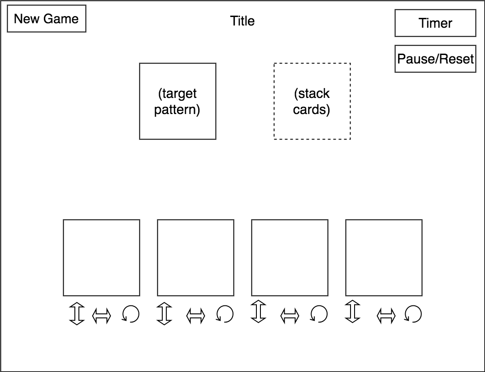

# On The Dot

## About

[On the Dot][gamewright] is a pattern-matching board game that usually supports 1-4 players. This implementation will be a solitaire version.

#### Game play
 At the beginning of each round, the player is shown a square card with a pattern of multi-colored dots. They will also receive four transparent cards that each have four dots (one green, one red, one blue, one yellow). The goal of the game is to manipulate the transparent cards (by flipping, rotating, and stacking them on top of each other) until they match the target pattern.

 *I will also be adding a timer to this version of the game, in order to make the player come to a conclusion quickly, simulating the pressure of a multi-player game.*

[gamewright]:http://www.gamewright.com/gamewright/index.php?section=games&page=game&show=225

## MVPs
The finished game will have the following features:

- [ ] Board resets with a different starting pattern on refresh
- [ ] Players can manipulate cards by rotating, flipping, and stacking
- [ ] Players can pause, resume and reset timer
- [ ] Has at least 20 playable rounds

## Wireframe

The game will have just one view, which will include the current pattern to match, a display of all four transparent cards in the player's hand (and the buttons to manipulate them), a place to stack those cards, and a nav bar with options to start a new game or pause/resume the timer.

## Structure
The game will be created using vanilla JavaScript & HTML5 Canvas.

The logic of the game will be handled by separate JS classes:

+ Card will handle the logic of manipulating a single card, which will be rendered in a single canvas. A Card object will keep track of its own rotation, side, and z-index.

+ Pattern will handle generating a new target pattern canvas each round

+ Timer will handle the countdown for each round

+ Game will handle the game logic, checking to see if the current state of the cards match the pattern and initiating a new pattern/round if they do

## Timeline

##### Day 1:

+ Set up and configure app: create files for all the necessary classes, as well as a webpack entry file
+ Set up cards:
    + Create canvases for rendering and write out script for changing position, etc.
    + Create buttons and event listeners to handle card manipulation (rotation & flip)

##### Day 2:

+ Style app:
  + Select & apply color theme & font
  + Add animation to card changes
+ Implement target pattern:
  + Create target canvas and write script for generating a new configuration each round
  + Style target pattern

##### Day 3:

+ Game script:
  + Create stack that will keep track of the current card positions and resulting pattern
  + Write logic to handle checking success
+ Finish any styling that needs to be done for the main layout

##### Day 4:

+ Add timer to app:
  + Insert HTML element
  + Write a script to handle the countdown
  + Include button and click event handler to pause
  + Refactor Game script to reset timer each round
